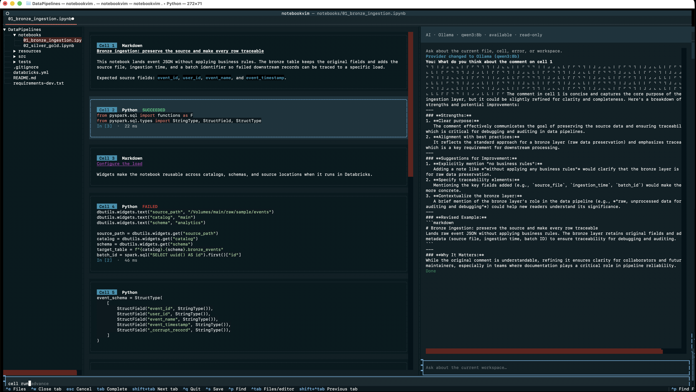

# NotebookVim

notebookvim is a keyboard-first CLI built for fast, focused development of data projects.

Designed for developers and data enthusiasts who feel at home in Vim, it brings notebooks, code, data exploration, and project tools together in one streamlined terminal workspace—so you can move from an idea to working code without reaching for the mouse.
* **Vim-inspired editing** — Navigate and edit notebooks, Python, SQL, and project files entirely from the keyboard.
* **Interactive execution** — Run cells in a persistent kernel and preserve state as you experiment.
* **Built-in data exploration** — Query local data with SQL, inspect datasets, and access profiling tools.
* **Databricks connectivity** — Connect your local workflow to remote data and compute.
* **Integrated AI** — Work with Codex, Claude, or Ollama without interrupting your flow.
* **Full terminal access** — Run commands and manage your entire project from the same interface.

Python and SQL are supported today, with Scala and R planned for future releases. A provider-neutral connectivity layer also lays the groundwork for platforms such as Microsoft Fabric.

Whether you are exploring data, prototyping an idea, or building a production pipeline, notebookvim helps you work quickly, stay in flow, and keep your hands on the keyboard.



## Install

Install the published package with pip:

```bash
python -m pip install notebookvim
```

For an isolated command-line installation, use `pipx`:

```bash
pipx install notebookvim
```

The package installs the `notebookvim` command.

### Development setup

```bash
python3 -m venv .venv
source .venv/bin/activate
python -m pip install -e '.[dev]'
```

## Use

```bash
cd path/to/project
notebookvim

notebookvim new experiment.ipynb
notebookvim experiment.ipynb
notebookvim path/to/project
```

Opening `notebookvim` without a path starts a project workspace in the current
directory. Use `Ctrl+E` to toggle the project tree and `Ctrl+P` to fuzzy-find a
file. Selecting a notebook or supported UTF-8 text file opens it without leaving
the application. Python, Markdown, JSON, TOML, YAML, SQL, shell, and other common
source files receive syntax highlighting; use `Ctrl+S` to save and `Ctrl+Q` to
quit from the text editor. Generated
directories such as `.git`, `.venv`, `node_modules`, and `__pycache__` are
hidden from the navigator.

Selecting a `.parquet`, `.parq`, or `.pq` file opens a read-only preview of its
first 25 rows followed by Spark-style `count`, `mean`, `stddev`, `min`, and
`max` summary statistics. Statistics are calculated directly with PyArrow;
Spark is not started.

### Parquet and Delta inspection

With a Parquet file open, typing `:inspect` prioritizes contextual
`inspect parquet …` completions. Available metadata views are:

```text
:inspect parquet describe
:inspect parquet profile
:inspect parquet partitions
:inspect parquet rowgroups
:inspect parquet schema
:inspect parquet files
:inspect parquet history
```

Describe shows physical format, dimensions, compression, producer, and metadata
size. Schema includes nested fields and field metadata; row groups include row
counts and sizes; partitions recognize Hive-style `key=value` paths. Plain
Parquet has no transaction history, so its history view reports filesystem
modification information and explains that limitation.

If the open Parquet file is below a Delta table root containing `_delta_log`,
Delta completions are added automatically:

```text
:inspect delta describe
:inspect delta profile
:inspect delta version
:inspect delta schema
:inspect delta partitions
:inspect delta rowgroups
:inspect delta history
:inspect delta files
:inspect delta properties
:inspect delta cdf
:inspect delta time travel 12
```

The inspector reconstructs snapshots from retained JSON commits and Parquet
checkpoints, including multipart checkpoints and referenced V2 sidecars. It
replays add/remove actions for current or historical versions and exposes table
metadata, protocol versions, active files, per-file statistics, commit
operations, properties, and change-data-file actions. Reports are read-only and
limited to 500 rows where a table may contain many files or row groups.

Delta profiling uses DuckDB over the active snapshot files. It deliberately
refuses snapshots containing deletion vectors because a direct Parquet scan
would otherwise include logically deleted rows.

Inspection metadata opens in a scrollable overlay by default. Press `Escape`
to close it and return to the same file and cursor context; inspection does not
create or switch document tabs. Append `side` or `below` to keep a report next
to the source while working, and close a pinned report with `Escape` or
`:inspect close`:

```text
:inspect parquet schema side
:inspect parquet rowgroups below
:inspect delta history side
:inspect close
```

The terminal, AI assistant, and inspection report share the auxiliary split
area, so opening one closes the others instead of squeezing the source into
three panes.

### Local SQL and dataset profiles

Open a syntax-highlighted, entirely local DuckDB workspace with `:sql`. Enter
SQL, press `Escape`, and use these commands:

```text
:sql                 Open the existing SQL tab, or create one
:sql new             Open another SQL tab
:sql run             Run the current query (up to 200 displayed rows)
:sql explain         Show the DuckDB query plan
:sql history         Show recent session queries
:sql save            Save the query under queries/
:sql cancel          Cancel a running query (Ctrl+C also works)
```

DuckDB can query project data directly without starting Python, Spark, or a
server—for example, `SELECT * FROM read_parquet('data/sales.parquet')` or
`SELECT * FROM read_csv_auto('data/sales.csv')`. Results remain attached to the
SQL tab and include execution time and a truncation marker when more rows exist.

From a Parquet preview or SQL workspace, use `:profile` (or `:profile current`)
to open a profile tab. It shows shape, types, null rates, approximate distinct
counts, min/max, mean, standard deviation, quartiles, common values, inferred
identifier/timestamp/categorical roles, and available Parquet metadata. Use
`:profile save` or `Ctrl+S` from the profile tab to export the result as JSON in
the project root. Profiling uses DuckDB summaries and bounded top-value checks;
it does not load the whole dataset into application memory.

Project editing shortcuts:

```text
Ctrl+Tab        Move between the file browser and active editor
Option+Enter    Open the selected browser file in a new tab (Alt+Enter in terminals)
Shift+Tab       Move to the next open tab
Ctrl+Shift+Tab  Move to the previous open tab
Ctrl+W          Close the active tab (`:tab close` also works)
Escape, then q  Close the active file/tab
Ctrl+E, then t  Terminal-safe way to focus the browser and open a file in a tab
Escape, then ]/[ Terminal-safe next / previous tab
u / Ctrl+R      Undo / redo in Normal mode
:               Open commands in Normal mode
```

The status bar keeps the essential controls visible: `:` for commands,
`:help`, `Ctrl+E` for files, `i` to edit, `Ctrl+S` to save, and `Ctrl+Q` to
exit. Closing the final tab leaves the project browser and command system open
and shows the NotebookVim welcome screen. From there, open another file or use
`Esc`, then `:` to enter a command, just as you would return to commands in Vim.

Python text files and Python notebook cells receive local Jedi completions;
press `Tab` to accept a displayed completion. Markdown and other supported text
files retain syntax highlighting without Python completions.

Editable files open in Vim-style Normal mode and cannot be changed until you
press `i`, `a`, `I`, `A`, `o`, or `O`. The status bar shows `NORMAL`, `INSERT`,
or `VISUAL`. In a text file, Normal mode supports `h`/`j`/`k`/`l`, `w`/`b`,
`0`/`$`, `gg`/`G`, `dd`, `yy`, `x`, `p`/`P`, `u`, `Ctrl+R`, and character-wise
Visual mode with `v`. Press `Escape` to return to Normal mode. Python files
keep local completions in Insert mode, and `Tab` accepts a suggestion.

Platform-style cursor shortcuts work alongside Vim motions. On macOS,
`Command+Left/Right` goes to the start/end of a line and
`Command+Up/Down` goes to the start/end of the document. On Windows and Linux,
`Ctrl+Left/Right` moves by word and `Ctrl+Up/Down` moves to the start/end of the
document. Add `Shift` to extend the selection. `Option+Left/Right` also moves by
word on macOS. Command-key delivery depends on the terminal exposing enhanced
keyboard events; Home/End and the Vim motions remain available everywhere.

Notebook cells use the same modal idea. Press `Enter` on a selected cell to
open it in cell-Normal mode, then `i` to edit. The first `Escape` returns from
Insert to cell-Normal mode; a second `Escape` commits the cell and returns to
notebook navigation. Pressing `i` from notebook navigation remains a shortcut
that opens the cell directly in Insert mode. Use `j`/`k` to select cells,
`o`/`O` to create and edit a cell below/above, `dd` to delete, `yy` to copy,
`p`/`P` to paste below/above, `u`/`Ctrl+R` to undo/redo, `gg`/`G` for the
first/last cell, `J`/`K` to move a cell, `m` to switch code/Markdown, and
`r`/`R` to run or run-and-advance. Arrow keys remain available. `Enter` does
not enter Insert mode.

Press `:` in navigation mode for commands. Selected-cell commands include:

Command mode recalls the last submitted command for the current session. Open
it again with `:`, press `Enter` to rerun the recalled command, or `Escape` to
cancel and clear the visible input.

```text
:cell run                  :run cell 2
:cell output clear
:cell add above            :cell add below
:cell delete               :cell duplicate
:cell move up              :cell move down
:cell type code            :cell type markdown
```

Displayed cell numbers are one-based and include every code and Markdown cell.
For example, `:run cell 2` selects and executes the second cell when it is a
code cell.

Notebook and kernel commands include `:notebook run all`, `:notebook save`,
`:kernel info`, `:kernel interrupt`, `:kernel restart`, and `:kernel shutdown`.
Use `:help` in the application for the complete list. `:q` closes the active
file/tab—including the final tab—while `:wq` saves and closes it. `:exit` exits notebookvim after the usual
unsaved-work confirmation. Other short aliases include `:run`,
`:output clear`, and `:w`.

The command bar shows matching commands in a selectable list as you type. Use
Up/Down to choose an option, Tab to fill it, and Enter to run it. This includes
command arguments such as every available option after `:theme`. Open a project
file by its workspace-relative path with `:file open reports/sales.py`, or open
it in a new tab with `:tab open reports/sales.py`; both commands complete file
paths from the current project, including subdirectories.

Create an empty file with `:file new reports/summary.py` or the equivalent
`:file create reports/summary.py`. You can also right-click a folder in the file
explorer and enter a filename; right-clicking a file uses its parent folder.

Run `notebookvim` with no argument to start with no project open; use `notebookvim .` to
open the current folder. Switch projects without leaving notebookvim using `:project open foldername` or its
alias `:folder open foldername`. Both commands complete folders inside the
current project; you may also type an absolute path or a relative path such as
`../another-project`. Unsaved files must be saved or closed before switching.
Use `:project close` or `:folder close` to clear the active project and return
to the welcome screen.

Initialize a Databricks-oriented medallion project in the current folder with
`:project scaffold init data-engineering`. It adds Bronze, Silver, and Gold
starter notebooks alongside `src`, `sql`, and `tests` folders, a README,
requirements, and a `.gitignore`. Existing files are always preserved, so the
command is safe to run again.
file/tab, `:wq` saves and closes it, and `:exit` exits notebookvim after the usual
unsaved-work confirmation. Other short aliases include `:run`,
`:output clear`, and `:w`.

Open a workspace terminal beside the active document with `:terminal`,
`:terminal open`, or `:terminal open side`. Use `:terminal open below` for a
lower split and hide either layout with `:terminal close`. The terminal keeps
its current directory and command history while hidden. Submitted lines are
forwarded to a running process, so prompts, confirmations, and interactive CLIs
work. Use Up/Down for history, Ctrl+L to clear its output, Ctrl+C to interrupt a
running command, and Escape to return focus to the editor. It uses a VS
Code-style dark terminal background, foreground, and 16-color ANSI palette.
Full-screen programs that require complete terminal-screen emulation should be
launched with a non-alternate-screen option when available.
Commands run through the configured macOS login shell in interactive mode, so
normal shell startup files and aliases are loaded. ANSI and true-color output
is preserved inside the terminal frame.

### AI assistants

Open the AI side pane with `:ai` or `:ai open`, or place it beneath the document
with `:ai open below`. Assistant answers render as Markdown, including headings,
lists, tables, emphasis, and fenced code blocks. Requests include
the active file plus a bounded snapshot of the selected notebook cell, text
file, or SQL query. `Ctrl+C` cancels a request and `Escape` returns to the
document.

```text
:ai status                 Show which provider CLIs are installed
:ai provider codex         Use Codex CLI
:ai provider claude        Use Claude Code
:ai provider ollama qwen2.5-coder:7b
                           Use Ollama with a specific installed model
:ai ask Explain this cell  Open the pane and send a prompt
:ai interrupt              Stop the running AI request and keep the pane open
:ai close                  Close the pane
```

The selected provider and Ollama model are saved in user settings. If the model
is omitted, `NOTEBOOKVIM_OLLAMA_MODEL` or `llama3.2` is used. Provider runs use safe
analysis modes: Codex uses a read-only sandbox and Claude Code uses plan mode.
Ollama receives prompt context without shell or file-editing tools.

### Databricks

Authenticate with the Databricks CLI, then connect the current notebookvim session:

```text
:databricks connect
:databricks connect MyProfile
:databricks connect https://your-workspace.cloud.databricks.com
:databricks connect MyProfile --serverless
:databricks connect MyProfile --cluster 0123-456789-abcdef
:databricks status
```

Passing a workspace URL opens browser-based OAuth, which is the easiest route
for Databricks Free Edition. With no argument, notebookvim uses default unified
authentication; a non-URL argument selects a named Databricks profile.

After connecting, Python notebook cells automatically receive `workspace` (a
Databricks `WorkspaceClient`) and `dbutils`. Local use of `dbutils` supports the
utility groups exposed by the Databricks SDK, including `fs`, `secrets`,
`widgets`, and `jobs`. For example:

```python
for item in dbutils.fs.ls("/"):
    print(item.path)
```

Credentials remain in the standard Databricks authentication configuration and
are not written into notebook files. Without a compute option this connection
provides workspace utilities and Spark remains local.

Add `--serverless` or `--cluster CLUSTER_ID` to create `spark` with Databricks
Connect. The Python kernel and ordinary Python statements still run locally,
while Spark DataFrame and SQL operations are planned locally and executed on the
selected Databricks compute. NotebookVim installs Databricks Connect as a core
dependency. Its version must match the target Databricks Runtime; for example,
`pip install "databricks-connect==17.3.*"`. Serverless requires Databricks Connect 15.4 LTS
or newer.

### Databricks explorer

Open a unified remote explorer after connecting:

```text
:databricks explorer
:databricks explorer open
:databricks explorer close
:explorer databricks open
:explorer databricks close
:explorer file open
:explorer file close
:databricks catalog
:databricks notebook [catalog.schema.table]
:databricks workspace
:databricks compute
:databricks workflows
:tables main.analytics
:describe main.analytics.customers
:sample main.analytics.customers
:sample main.analytics.customers 100
```

The explorer contains lazy-loaded `Workspace Items`, `Catalogs`, `Compute`, and
`Workflows` branches. Compute contains serverless, clusters, and SQL warehouses;
Workflows contains jobs, runs, and pipelines. The focused commands above open the same tree
focused on their corresponding branch. Use `j`/`k` to move, `h` to collapse or move to the
parent, `l` or `Enter` to expand/open, `/` to fuzzy-search loaded items, and `r`
to refresh a branch. Catalog
metadata and descriptions use the workspace API and do not require compute.
Sampling requires a connection created with `--serverless` or `--cluster` and
runs a bounded Spark query on that remote compute.

### Bundle visualization

Open a bundle's root `databricks.yml`, then visualize its resources and job task
dependencies without connecting to a workspace:

```text
:databricks bundle visualize
:databricks bundle visualize --target prod
```

NotebookVim resolves the root file's `include` patterns, applies the selected or
default target, and opens a read-only report containing the execution graph,
task types, dependencies, source files, pipelines, and resource counts.
The report begins with a downward job-to-task execution tree before the detailed
task table, so parallel roots and dependent branches are visible immediately.

### Python execution visualization

Open and save a Python source file, then build a downward static execution tree:

```text
:execution python visualize
:execution python main
:execution python entry
:databricks execution python main
```

The tree starts at module-level execution and follows locally defined function
and method calls in source order. It marks recursion, external or dynamic calls,
source lines, and definitions not reached from module execution. The source is
parsed but never executed.

The `main` and `entry` commands are aliases that search the entire project for
packaged console scripts, `__main__.py`, `if __name__ == "__main__"` guards,
and conventional `main()` or `cli()` functions. Results are ranked by confidence
and include their source file and line.
When a project contains `databricks.yml`, root job tasks with no dependencies
take precedence as certain orchestration entry points. Their Python files are
resolved through the bundle and included YAML, and the first local function
called by the file is reported when static analysis can identify one.
Use `:databricks execution python main` for a focused report containing only
those Databricks root Python tasks. Multiple results represent independent
starting branches that Databricks can run in parallel.

### Static Spark evaluation

Open and save a Python file containing PySpark code, then evaluate it without
starting Spark:

```text
:execution spark evaluate
:execution spark visualize
```

The evaluator classifies sources, narrow and wide transformations, partitioning,
joins, windows, persistence, and actions. It marks definite, probable,
conditional, and runtime-dependent shuffle behavior. The visualization places
an estimated downward stage flow above the detailed assessment. It is a static
estimate: Spark statistics, data sizes, join selection, and adaptive query
execution can change the real physical plan.

Select `Serverless` or a cluster under Compute with `Enter` to make it the
Databricks Connect target. The remote Spark session is created lazily when the
next table sample or Spark cell runs.

`:databricks notebook` opens an editable scratch notebook that lives only for
the current session. It inherits the selected compute, automatically selects
Serverless when no compute is selected, and starts with a `spark.table(...)`
cell. Supply a full table name to prefill it, or press `o` on a table in the
catalog tree. Saving is intentionally disabled for these scratch tabs.

Selecting a file or notebook under Workspace Items exports it directly from
Databricks and opens it in a read-only editor tab with language-aware syntax
highlighting. Python, SQL, Scala, and R notebooks are exported in Databricks
source format. Databricks Git/Repo folders are expandable, and UTF-8 project
files such as `.sql`, `.py`, `.yml`, `.yaml`, `.toml`, `.json`, and Markdown
open directly. Text files up to 2 MiB are supported.

The sidebar stacks available explorers vertically as compact drawers, with the
active explorer marked (`●`) and minimized explorers marked (`○`). Once
the Databricks explorer has been opened, press `Ctrl+E` while the sidebar is focused to switch
between the file and Databricks explorers. `Ctrl+Tab` moves focus between the
active explorer and the editor without changing explorers.

Resize the focused explorer with `Ctrl+Right` and `Ctrl+Left`, or use
`:explorer wider`, `:explorer narrower`, and `:explorer reset`. The width ranges
from 20 to 80 columns.

### Remote notebook synchronization

After connecting to Databricks, map the active local notebook or source file to
a workspace notebook:

```text
:databricks sync set /Workspace/Users/me@example.com/Analysis
:databricks sync set /Workspace/Users/me@example.com/Analysis --strip-outputs
:databricks sync status
:databricks sync diff
:databricks sync pull
:databricks sync push
```

Supported working-copy formats are `.ipynb`, `.py`, `.sql`, `.scala`, and `.r`.
Mappings and the last synchronized content hash live under `.notebookvim/`, which is
hidden from the project browser. Jupyter notebooks use the native Jupyter
workspace format so notebook and cell metadata survive round trips. Source
notebooks use the matching Databricks language.

Safety rules are deliberately strict:

- Pull never overwrites unsaved editor changes.
- Pull also stops when the saved local file changed since synchronization.
- Push stops when the remote content changed since synchronization.
- `:databricks sync diff` displays source changes by notebook cell.
- Resolve a reviewed conflict with `:databricks sync resolve local` (force
  push) or `:databricks sync resolve remote` (force pull). Both require saved
  local work.
- `--strip-outputs` removes code outputs and execution counts from uploaded
  Jupyter notebooks while leaving the local file unchanged.

You may also provide the mapping on the first operation, such as
`:databricks sync push /Workspace/Users/me@example.com/Analysis`.

### Remote jobs and logs

Databricks jobs use the same authenticated connection:

```text
:databricks jobs
:databricks jobs running
:databricks run 12345 --param date=2026-08-19 --param region=eu
:databricks logs 98765
:databricks logs follow 98765
:databricks cancel 98765
:databricks rerun 98765
```

The job and run views show identifiers, state, result, start time, duration,
parameters, compute ID, and the Databricks run link. A run ID can be omitted
from logs, cancel, and rerun immediately after `:databricks run`; notebookvim remembers
the most recently started run. Follow mode refreshes every two seconds until a
terminal state is reported.

Databricks returns standard-stream driver logs for supported non-notebook task
types and notebook exit values or failures for notebook tasks. It does not
return notebook driver stdout through the Jobs output endpoint; complete
cluster logs require a log destination configured on the Databricks job.

This initial remote provider is Databricks. The synchronization and report
models are provider-neutral, but Microsoft Fabric authentication, definition
conversion, job execution, and log retrieval still require a Fabric adapter.

### Git profiles

Named Git profiles keep commit identity and provider account selection together.
Credentials remain in GitHub CLI, Git Credential Manager, or the operating
system credential store; notebookvim never stores access tokens or passwords.

```text
:git profile add personal github layanwije me@example.com "My Name"
:git profile add work azure me@company.com me@company.com "My Name"
:git profile list
:git profile use personal
:git login personal
:git status
:git pull
:git push
```

GitHub browser login requires `gh` or Git Credential Manager. Azure DevOps
browser login requires Git Credential Manager and uses Microsoft OAuth. Profile
selection writes the profile's author name and email to the current repository,
so it does not change the identity of unrelated projects.

Other commands:

```bash
notebookvim run experiment.ipynb
notebookvim info experiment.ipynb
notebookvim --help
```

## Development

```bash
pytest
```
